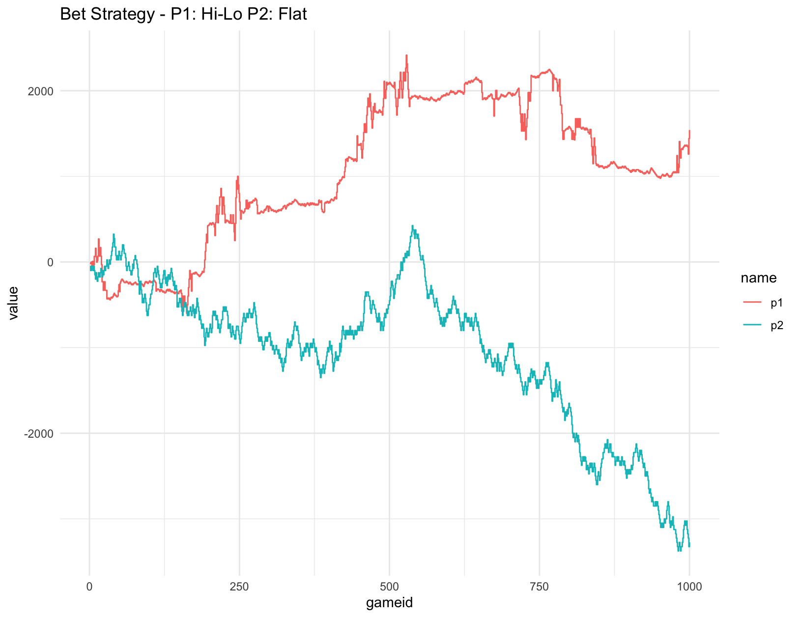

# Card counting strategy

A quick look into the benefits of different card counting systems. Blackjack game and simulation created in R instead of using the sensible approach of the "blackjack-v0" environment from OpenGym.

To run, update the variables in 03_simulation.R then run 00_main.R.

Further work can be done on more optimally adjusting bet sizing (potentially using some form of Kelly criteron based on the win percentage of the current deck), and also trying to determine the best count strategy using reinforcement learning.

An example of using a counting strategy is below, showing player 1 using a 'Hi-Low' count system (min size:10, max size:100, spread:10), whilst player 2 just flat bets 50, over 1000 games.

